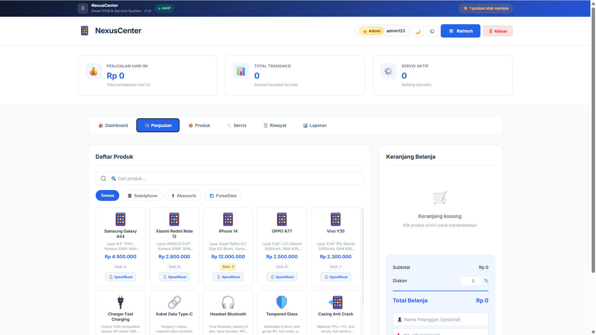
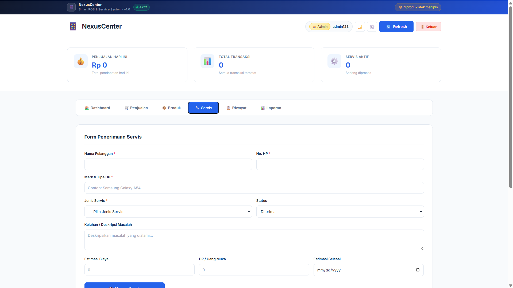
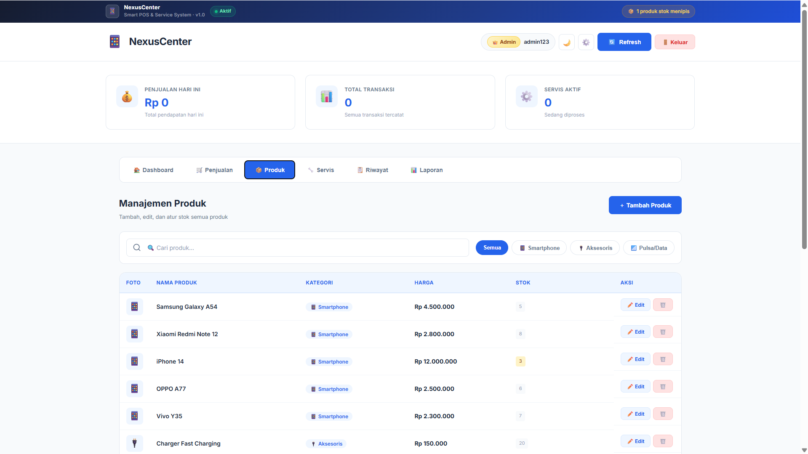

# 📱 NexusCenter - Aplikasi Counter HP & Service Management

Aplikasi web manajemen counter HP dan layanan servis yang dirancang untuk pemilik toko, kasir, dan teknisi HP. Aplikasi ini memudahkan pengelolaan transaksi penjualan produk (smartphone, aksesoris, pulsa) serta pelacakan status perbaikan servis gadget secara real-time dan terorganisir.

---

## 🛠️ Tech Stack

- **Frontend Core:** HTML5, Vanilla JavaScript (ES6+)
- **Styling:** Vanilla CSS (Glassmorphism UI, Dark & Light Mode Support, Responsive Design)
- **Backend / Platform:** Google Apps Script (GAS) & Node.js Clasp CLI
- **Database & Storage:** Browser `LocalStorage` & Google Sheets API (`SpreadsheetApp`)
- **Icons & Fonts:** FontAwesome 6, Google Fonts (Inter / Poppins)

---

## 📸 Screenshot / Video Demo

> *Tampilan antarmuka aplikasi NexusCenter Counter HP:*

![Demo Application]   

---

## 🚀 Cara Install dan Menjalankan

Ikuti langkah-langkah berikut untuk menjalankan project ini di lingkungan lokal Anda:

### Prasyarat
- Browser modern (Google Chrome, Mozilla Firefox, atau Microsoft Edge)
- Git (opsional)
- Node.js & npm (opsional, jika ingin menggunakan CLI `@google/clasp`)

### Langkah-Langkah

1. **Clone Repository**
   ```bash
   git clone https://github.com/juniorbenerd18-byte/ConterHP.git
   cd ConterHP
   ```

2. **Menjalankan Secara Lokal**
   - **Metode Direct Browser:** Buka file `counter-hp.html` atau `Index.html` secara langsung dengan mengklik dua kali file tersebut atau drag-and-drop ke browser.
   - **Metode VS Code Live Server:** Buka folder project di VS Code, klik kanan pada file `Index.html`, lalu pilih **Open with Live Server**.

3. **Deployment / Sync dengan Google Apps Script (via Clasp CLI)**
   ```bash
   # Install clasp secara global
   npm install -g @google/clasp

   # Login ke akun Google
   clasp login

   # Push perbaikan ke Google Apps Script
   clasp push
   ```

---

## 🌐 Link Demo Live

Aplikasi ini telah di-deploy sebagai Google Apps Script Web App dan dapat diakses secara live pada link berikut:
- **Live Demo Web App:** [NexusCenter Live Demo] https://script.google.com/macros/s/AKfycbxDV5j_zHXUFHY1BYCS1KXbaRrmEIiWaCtG1Ze62VE/dev

---

## 💼 Link Edusoft Portfolio

Bukti resmi pengerjaan dan dokumentasi proyek ini terhubung dengan platform Edusoft Portfolio:
- **Edusoft Portfolio:** [Halaman Proyek Edusoft Portfolio] https://portfolio.edusoftcenter.com/contributors/junior-alfredo-benerd-setiawan
---

## 🎯 Fitur Utama

- 🛒 **Penjualan & Kasir (POS):** Katalog produk (HP, Aksesoris, Pulsa/Paket Data), keranjang belanja, diskon, opsi pembayaran beragam (Tunai, Transfer, QRIS, Debit), serta kalkulasi kembalian otomatis.
- 🔧 **Manajemen & Tracking Servis:** Form penerimaan servis, estimasi biaya/DP, dan tracking status perbaikan (Diterima, Dalam Proses, Menunggu Sparepart, Selesai, Diambil).
- 📋 **Riwayat & Cetak Nota:** Riwayat transaksi lengkap beserta opsi pencetakan nota/struk secara fisik atau simpan PDF.
- 📊 **Laporan & Statistik:** Ringkasan pendapatan periode harian, mingguan, bulanan, dan analisis produk terlaris.
